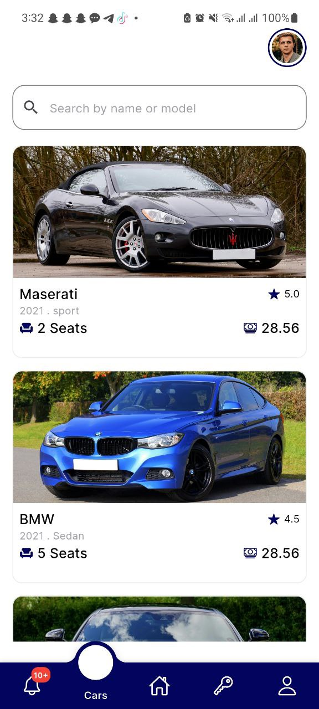

# Car Rental App

Welcome to the **Car Rental App**, a Flutter-based mobile application that provides a seamless experience for users to rent cars, select rental dates, and browse through a list of available cars. This app is designed with a user-friendly interface, allowing easy booking and selection for your car rental needs.

## 📱 Features

- **Car Listing**: Browse through a variety of cars with detailed specifications such as name, model, price, seat capacity, and rating.
- **Date Selection**: Users can select both rental start and return dates, with a smooth date-picker functionality.
- **Search Functionality**: Search for cars by name or model to find your perfect ride quickly.
- **User Profile**: View user profile with a circular profile avatar.
- **Responsive UI**: Optimized for various screen sizes with clean and modern UI.

## 🚀 Getting Started

To get started with this project, you will need to have Flutter installed. You can follow the instructions from the official Flutter documentation to set up your environment.

### Installation

1. **Clone the Repository**:

   ```bash
   git clone https://github.com/yourusername/car_rental_app.git
   ```

2. **Navigate to the Project Directory**:

   ```bash
   cd car_rental_app
   ```

3. **Install Dependencies**:

   Run the following command to install all the necessary packages:

   ```bash
   flutter pub get
   ```

4. **Run the App**:

   You can run the app on your desired platform (Android or iOS) with the following command:

   ```bash
   flutter run
   ```

## 📸 Screenshots

<!-- Upload and drag the screenshots here -->
<p align="center">
   
   
   
  
   
</p>

## 🔑 Key Features

1. **Car Listing**: Display a list of available cars for rental, showing details such as:
   - Car Name
   - Model
   - Price per hour
   - Seat capacity
   - Rating

2. **Date & Time Selection**: Choose rental and return dates with an integrated date-time picker.

3. **Search Functionality**: Search cars by name or model for quick access to your desired vehicles.

4. **Smooth Navigation**: Easily navigate through car listings and select rental periods with intuitive UI.

## 📂 Project Structure

The project follows a modular structure for scalability and maintenance:

```
lib/
│
├── core/
│   └── colors/               # App theme and color settings
│
├── features/
│   ├── Cars/                 # Car listing and details
│   ├── Home/                 # Home screen and navigation
│   └── Profile/              # User profile section
│
├── widgets/                  # Reusable widgets such as car cards
└── main.dart                 # Entry point of the app
```

## 🔧 Technologies Used

- **Flutter**: The framework used for building the app.
- **Dart**: Programming language used in Flutter.
- **Syncfusion**: For implementing date and time pickers.
- **Google Fonts**: Custom fonts for UI.

## 📄 License

This project is licensed under the MIT License - see the [LICENSE](LICENSE) file for details.

---

Feel free to customize the above content, add the screenshots after uploading, and update the repository link!
